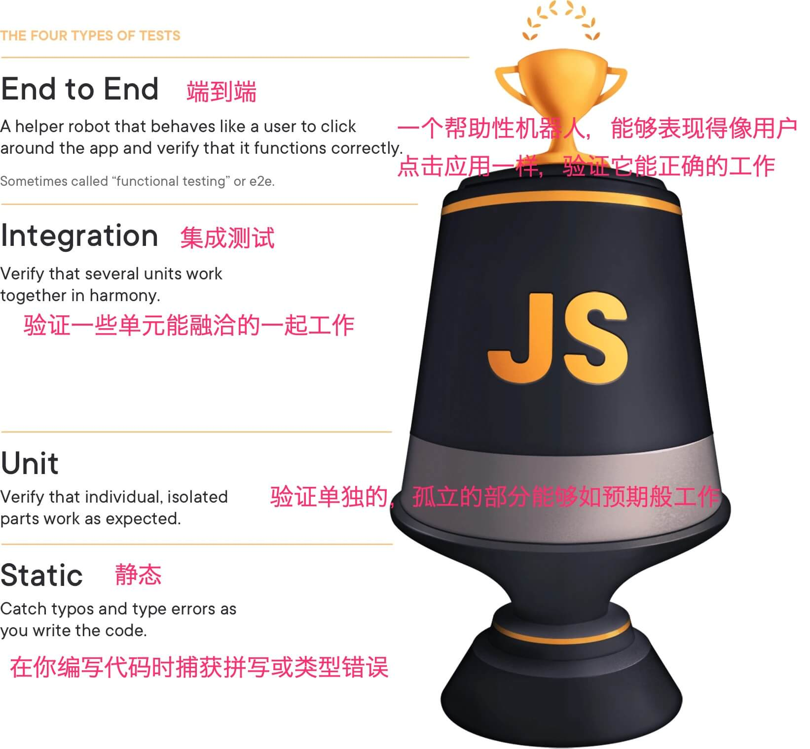

# 前端应用的“静态-单元-集成-端到端测试”

这些术语意味着什么，为什么它们重要，以及为什么它们不重要

在 TestingJavaScript.com 上的"与 [J.B. Rainsberger](https://twitter.com/jbrains) 的测试实践"采访中，他讲了我一个我非常喜欢的比喻。他说：

> 你可以把油漆甩到墙上，最终你可能会覆盖大部分的墙，但除非你拿着刷子走到墙边，否则你永远不会覆盖到墙角。🖌️

我喜欢这个比喻，它适用于测试，因为它基本上是说，选择正确的测试策略与选择刷墙的刷子是同样的选择。你会用一把细点的刷子来刷整面墙吗？当然不会。那会花费太多时间，而且最终的结果可能看起来不是很均匀。你会用滚筒来刷所有的东西吗，包括你的曾曾祖母两百年前从海上带来的定型家具？不可能。不同的使用情况有不同的刷子，这同样也适用于测试。

这就是我[提出”测试奖杯“的原因](https://twitter.com/kentcdodds/status/960723172591992832)。此后，Maggie Appleton（egghead.io 背后的策划者，主艺术/设计师）为 TestingJavaScript.com 创作了这个：



这些测试形式在奖杯上的规模是相对于你在测试你的应用程序时应该给予它们的关注度而言的（一般而言）。我想深入介绍一下这些不同形式的测试，它的实际意义，以及我们可以做什么来优化我们的测试，以获得最大的收益。

## 测试类型

让我们从上到下看一下这些类型的测试的几个例子。

### 端到端

通常，这些测试代码将运行整个应用程序（包括前端和后端），你的测试将与应用程序互动，就像一个典型的用户一样。下面这些测试是用 cypress 编写的。

```javascript
describe("todo app", () => {
  it("should work for a typical user", () => {
    const user = generate.user();
    const todo = generate.todo();
    // here we're going through the registration process.
    // I'll typically only have one e2e test that does this.
    // the rest of the tests will hit the same endpoint
    // that the app does so we can skip navigating through that experience.
    cy.visitApp();
    cy.findByText(/register/i).click();
    cy.findByLabelText(/username/i).type(user.username);
    cy.findByLabelText(/password/i).type(user.password);
    cy.findByText(/login/i).click();
    cy.findByLabelText(/add todo/i)
      .type(todo.description)
      .type("{enter}");
    cy.findByTestId("todo-0").should("have.value", todo.description);
    cy.findByLabelText("complete").click();
    cy.findByTestId("todo-0").should("have.class", "complete");
    // etc...
    // My E2E tests typically behave similar to how a user would.
    // They can sometimes be quite long.
  });
});
```

### 集成测试

下面的测试渲染了完整的应用程序。这不是集成测试的要求，我的大多数集成测试都不会渲染整个应用程序。然而，他们将渲染我的应用程序中使用的所有提供者（这就是想象中的`test/app-test-utils`模块的`render`方法）。集成测试的理念是尽可能少地模拟。我几乎只模拟：

- 网络请求（使用 MSW）
- 负责动画的组件（因为谁会想在你的测试中等待这个？）

```javascript
import * as React from "react";
import { render, screen, waitForElementToBeRemoved } from "test/app-test-utils";
import userEvent from "@testing-library/user-event";
import { build, fake } from "@jackfranklin/test-data-bot";
import { rest } from "msw";
import { setupServer } from "msw/node";
import { handlers } from "test/server-handlers";
import App from "../app";

const buildLoginForm = build({
  fields: {
    username: fake((f) => f.internet.userName()),
    password: fake((f) => f.internet.password()),
  },
});

// integration tests typically only mock HTTP requests via MSW
const server = setupServer(...handlers);

beforeAll(() => server.listen());
afterAll(() => server.close());
afterEach(() => server.resetHandlers());

test(`logging in displays the user's username`, async () => {
  // The custom render returns a promise that resolves when the app has
  //   finished loading (if you're server rendering, you may not need this).
  // The custom render also allows you to specify your initial route

  await render(<App />, { route: "/login" });
  const { username, password } = buildLoginForm();

  userEvent.type(screen.getByLabelText(/username/i), username);

  userEvent.type(screen.getByLabelText(/password/i), password);

  userEvent.click(screen.getByRole("button", { name: /submit/i }));

  await waitForElementToBeRemoved(() => screen.getByLabelText(/loading/i));

  // assert whatever you need to verify the user is logged in

  expect(screen.getByText(username)).toBeInTheDocument();
});
```

对于这些代码，我通常也会有一些全局性的配置，比如在测试之间[自动重置所有的 mock](https://jestjs.io/docs/en/configuration#resetmocks-boolean)。

在[React testing library 设置文档](https://testing-library.com/docs/react-testing-library/setup/)中学习如何设置一个类似上面代码的 test-utils 文件。

### 单元测试

```javascript
import '@testing-library/jest-dom/extend-expect'
import * as React from 'react'

// if you have a test utils module like in the integration test example above
// then use that instead of @testing-library/react
import {render, screen} from '@testing-library/react'
import ItemList from '../item-list'
// Some people don't call these a unit test because we're rendering to the DOM with React.
// They'd tell you to use shallow rendering instead.
// When they tell you this, send them to https://kcd.im/shallow
test('renders "no items" when the item list is empty', () => {
  render(<ItemList items={[]} />)
  expect(screen.getByText(/no items/i)).toBeInTheDocument()
})

test('renders the items in a list', () => {
  render(<ItemList items={['apple', 'orange', 'pear']} />)
  // note: with something so simple I might consider using a snapshot instead, but only if:
  // 1. the snapshot is small
  // 2. we use toMatchInlineSnapshot()
  // Read more: https://kcd.im/snapshots
  expect(screen.getByText(/apple/i)).toBeInTheDocument()
  expect(screen.getByText(/orange/i)).toBeInTheDocument()
  expect(screen.getByText(/pear/i)).toBeInTheDocument()
  expect(screen.queryByText(/no items/i)).not.toBeInTheDocument()
```

每个人都称这是单元测试，他们是对的。

```javascript
// pure functions are the BEST for unit testing and I LOVE using jest-in-case for them!
import cases from "jest-in-case";
import fizzbuzz from "../fizzbuzz";
cases(
  "fizzbuzz",
  ({ input, output }) => expect(fizzbuzz(input)).toBe(output),
  [
    [1, "1"],
    [2, "2"],
    [3, "Fizz"],
    [5, "Buzz"],
    [9, "Fizz"],
    [15, "FizzBuzz"],
    [16, "16"],
  ].map(([input, output]) => ({
    title: `${input} => ${output}`,
    input,
    output,
  }))
);
```

静态测试

```javascript
// can you spot the bug?
// I'll bet ESLint's for-direction rule could
// catch it faster than you in a code review 😉
for (var i = 0; i < 10; i--) {
  console.log(i);
}
const two = "2";
// ok, this one's contrived a bit,
// but TypeScript will tell you this is bad:
const result = add(1, two);
```

## 我们为什么要再次测试？

我认为重要的是要记住为什么我们首先要写测试。你为什么要写测试？是因为我告诉你要写吗？是因为你的 PR 不包括测试就会被拒绝吗？是不是因为测试可以增强你的工作流程？

我写测试的最大和最重要的原因是信心。我想确信我为未来编写的代码不会破坏我今天在生产中运行的应用程序。因此，无论我做什么，我都想确保我所写的测试种类能给我带来最大的信心，我需要认识到我在测试时的权衡取舍。

## 让我们谈一谈权衡取舍

在这张图中，我想强调测试奖杯的一些重点（从我的幻灯片上提取出来）。


图片上的箭头标志着你在编写自动化测试时做出的三个权衡。

### 成本：低廉 ➡ 💰🤑💰

随着测试的不断深入，测试的成本也越来越高。这包括在持续集成环境中运行测试的实际费用，也包括工程师编写和维护每个测试的时间。

你的奖杯越高处，失败点就越多，因此测试就越有可能中断，导致需要更多时间来分析和修复测试。**请记住这一点，因为这很重要**

### 速度： 🏎💨 ➡ 🐢

随着你在测试奖杯往上移动，测试通常会运行得更慢。这是由于你在测试奖杯上的位置越高，你的测试运行的代码就越多。单元测试通常测试一些没有依赖性的小东西，或者会 mock 这些依赖（有效地将需要运行数千行的代码换成只有几行）。**请记住这一点，因为这很重要**

## 信心。简单问题 👌 ➡ 大难题 😖

当人们谈论测试金字塔时，通常会提到成本和速度的权衡 🔺。如果这些是唯一的权衡，那么我会把 100%的精力放在单元测试上，而完全忽略任何其他形式的测试。当然，我们不应该这样做，这是因为有一个超级重要的原则，你可能已经听我说过了。

> 你的测试越是类似于你的软件的使用方式，它们就越能给你带来信心。

这意味着什么呢？这意味着，没有比实际让你的“玛丽阿姨”使用你编写的税务软件进行报税更好的测试方法了。但是，我们不想等着“玛丽阿姨”为我们找 bug，对吗？这将花费太多时间，而且她可能会错过一些我们应该测试的功能。再加上事实上我们定期发布软件更新，不管有多少人都不可能跟上这个速度。

所以我们怎么办呢？我们做出权衡。我们如何做到这一点呢？我们写软件来测试我们的软件。当我们这样做的时候，我们总是在做权衡，现在我们的测试并不像我们有“玛丽阿姨”测试我们的软件时那样可靠地使用我们的软件。但我们这样做是因为我们用这种方法解决了我们的实际问题。这就是我们在测试奖杯的每个层面上所做的事情。

随着你在测试奖杯向上移动，你正在增加我所说的"信心系数"。这是每个测试能让你达到该水平的相对信心。你可以想象，在奖杯上面的是手工测试。这将使你从这些测试中获得真正伟大的信心，但测试将是非常昂贵和缓慢的。

早些时候我告诉你要记住两件事

> - 你的奖杯越高处，失败点就越多，因此测试就越有可能中断，导致需要更多时间来分析和修复测试。
> - 随着你在测试奖杯往上移动，测试通常会运行得更慢。这是由于你在测试奖杯上的位置越高，你的测试运行的代码就越多。单元测试通常测试一些没有依赖性的小东西，或者会 mock 这些依赖（有效地将需要运行数千行的代码换成只有几行）

这些说的是，你所在的测试奖杯位置越低，你的测试所覆盖的代码就越少。如果你在低处操作，你需要更多的测试来覆盖你的应用程序中相同数量的代码。一个测试也可以在更高的奖杯位置上。事实上，当你在测试奖杯越往下走，有些东西是不可能被测试的。

特别是，静态分析工具无法让你对你的业务逻辑有信心。单元测试无法确保当你调用一个依赖关系时，你会适当地调用它（尽管你可以断言它是如何被调用的，但你无法确保它被单元测试正确地调用）。UI 集成测试无法确保你向后端传递正确的数据，也无法确保你对错误做出正确的反应和解析。端到端测试是非常有能力的，但通常你会在非生产环境中运行这些测试（类似生产环境，但不是生产环境），以权衡这种信心和实用性。

现在让我们走另一条路。在测试奖杯的顶端，如果你试图使用 E2E 测试来检查在某个字段中输入并点击提交按钮，用于表单和 URL 生成器之间集成的边缘情况，你就会通过运行整个应用程序（包括后端）来做大量的设置工作。这可能更适合于集成测试。如果你试图使用集成测试来处理优惠券代码计算器的边缘情况，你可能在设置功能中做了相当多的工作，以确保你能渲染使用优惠券代码计算器的组件，你可以在单元测试中更好地覆盖这个边缘情况。如果你试图用单元测试来验证当你用字符串而不是数字来调用你的添加函数时会发生什么，那么你最好使用 TypeScript 这样的静态类型检查工具。

## 结论

每个级别都有自己的权衡。E2E 测试有更多的故障点，因此通常更难追踪到是什么代码导致的故障，但这也意味着你的测试给你更多的信心。如果你没有那么多时间来写测试，这就特别有用。我宁愿有信心，并面临追踪为什么会失败的问题，而不是一开始就没有通过测试发现问题。

最后，我并不关心这些区别。如果你想把我的单元测试称为集成测试，甚至是 E2E 测试（正如有些人所说的那样），那就这样吧。我感兴趣的是，在应用改变时我是否有信心，我的代码是否满足业务需求，我将使用不同的测试策略的组合来实现这一目标。

祝您好运!
